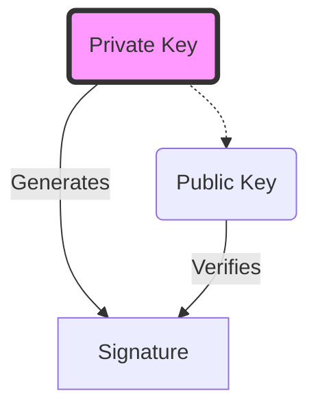
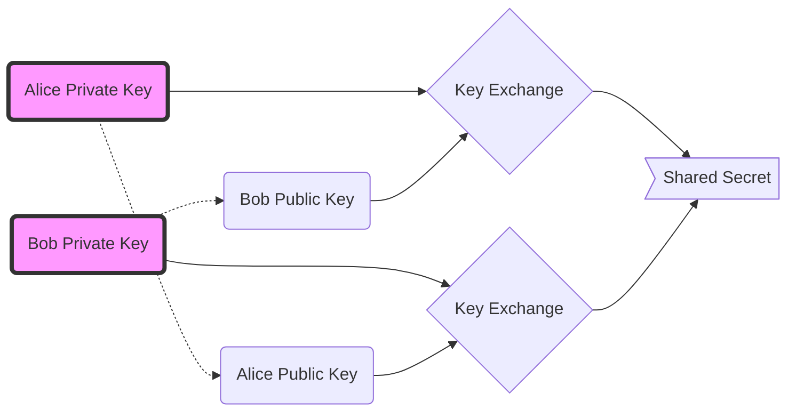
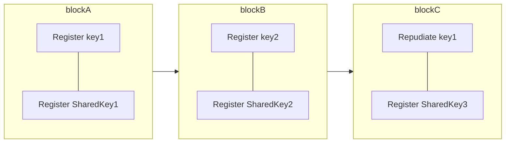

# Keynesis

`keynesis` is the library used to provide construct the digital identity
of a user on the network. Simply put it defines how to links some
cryptographic keypair together and provides them rolls.

## keys

Keynesis uses EdDSA (Edwards-curve Digital Signature Algorithm)
as signing algorithm, it is rather small and fast and
a very secure protocol. We use Curve25519 for the Diffie-Hellman
key exchange. Ed25519 keys are composed of two part. Also called
Ed25519 key pair. There is a `private key` and a `public key`.

### Signing

Signature are create with the `private key` and can be verified
with the `public key`. The digital `signature` offers non-repudiation.
This means that the `private key` cannot deny the authenticity of the
`signature` and the `document` once shared.



### Key exchange

Using a projection of the `Ed25519` keys we can perform a key exchange
(Diffie-Hellman key exchange). This allows to generate a shared secrets
between two parties without having to share anything more than
each other's public key.

For example: **Alice** generates a key pair, **Bob** generates a key pair.
**Alice** will combine her `private key` with **Bob**'s `public key` to generate
a shared secret. **Bob** will combine his `private key` with **Alice**'s
`public key` to generate the same shared secret.

> \\( Dh(Priv^{Alice}, Pub^{Bob}) = Dh(Priv^{Bob}, Pub^{Alice}) \\)



## Passport

A `passport` is defined as a set of `public key`s. Each `public key`
can represent a device of the user for example. Though it is not limited
to that only (one can add paper keys or HSM keys for example).

We use different keys in order to avoid asking the user to use a unique
passphrase across different devices. This is rather insecure and incentive
users to use rather weak passwords.

### Passport's chain

The passport is composed of a series of events: declaration of a new key,
repudiation of a key and more. This is a blockchain. Every blocks contains
the list of events (the updates to apply on the passport). Each blocks are
signed by any of the keys that are registered at the time of the block
creation. Each block referencing a previous block (hence the _chain_).

In order to create a new passport one simply creates a new block without
a previous block. Then new keys needs to be declared in order to allow
these keys to create blocks for the passport's chain.



### Passport's keys

the passport's keys are all the keys that have been registered
in the passport chain and that have not been repudiated yet.

Any of the passport keys can submit a new block in the passport's
chain. Allowing to declare or repudiate new keys in the passport.
But also to generate a new _Shared Key_ (see below) or any other
new event entries that may be defined later.

### Passport's shared key

The passport's keys are to maintain the state of the passport's chain.
Other protocols or interactions may requires to have other kind of
entries set in the passport's chain. Here we defines the passport's
_SharedKey_. It is a key that is encrypted for every other passport's
key. Every time a _SharedKey_ is register it deprecates the use of the
previously declared _SharedKey_s.

The `SharedKey` are encrypted using the [`Npsk0`] pattern of the noise protocol.
This allows to encrypt the data in such a way that only the recipient of
the key can retrieve the `SharedKey` if they also know the _pre shared key_.

```rust
let psk = ; // 32 bytes of pre shared key
let shared_secret_key = ; // curve25519 private key

for key in passport.keys() {
    let ephemeral = SecretKey::generate();

    let encrypted = noise::N::send(ephemeral, psk, key, shared_secret_key);
}
```

[`Npsk0`]: ./noise.md#pattern-npsk0