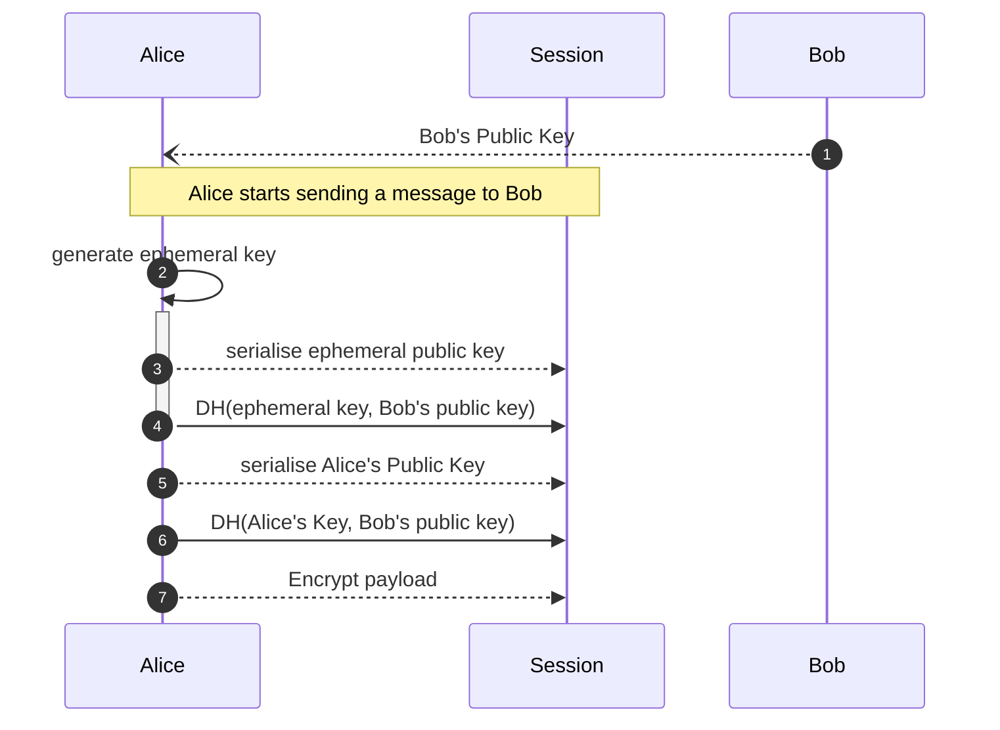
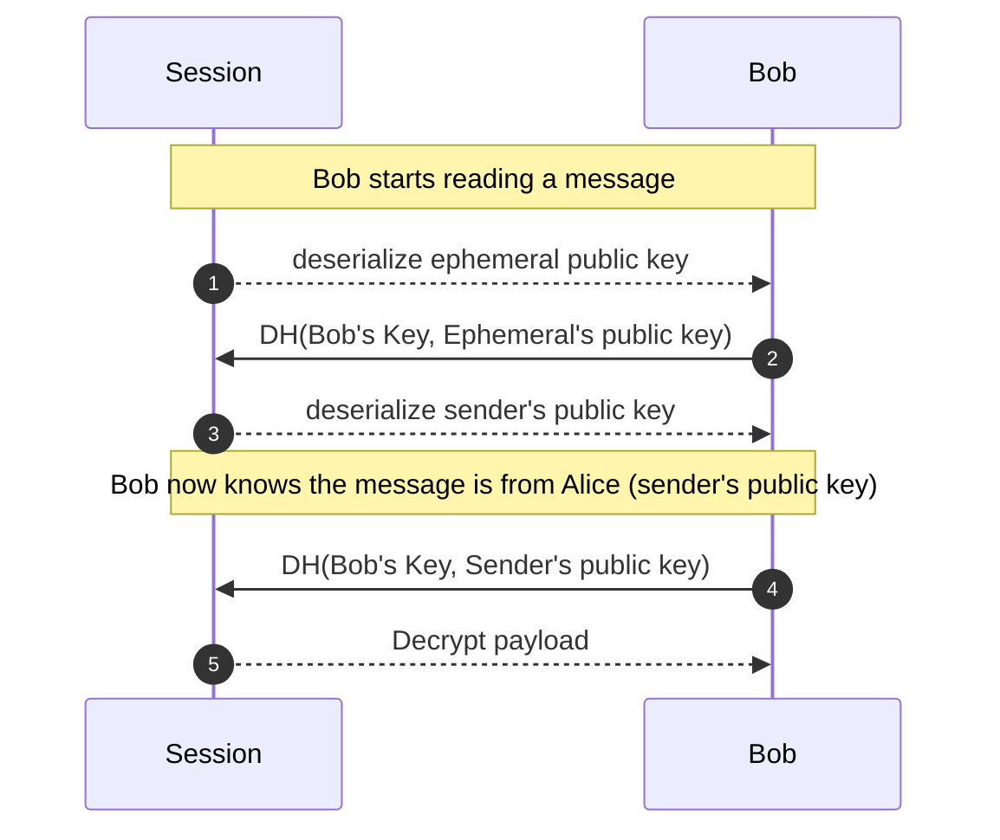
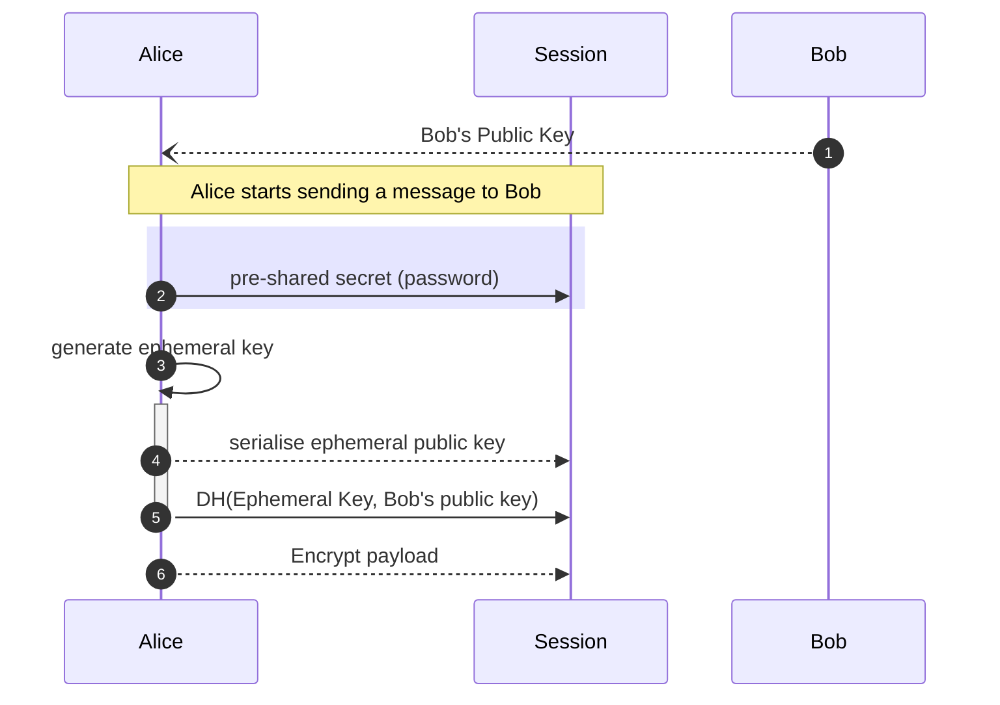
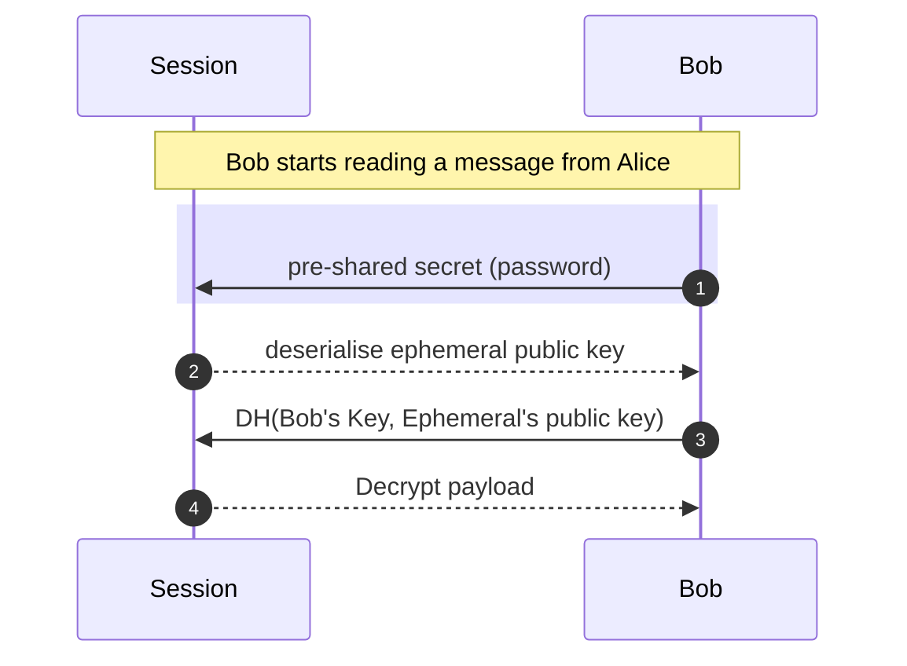
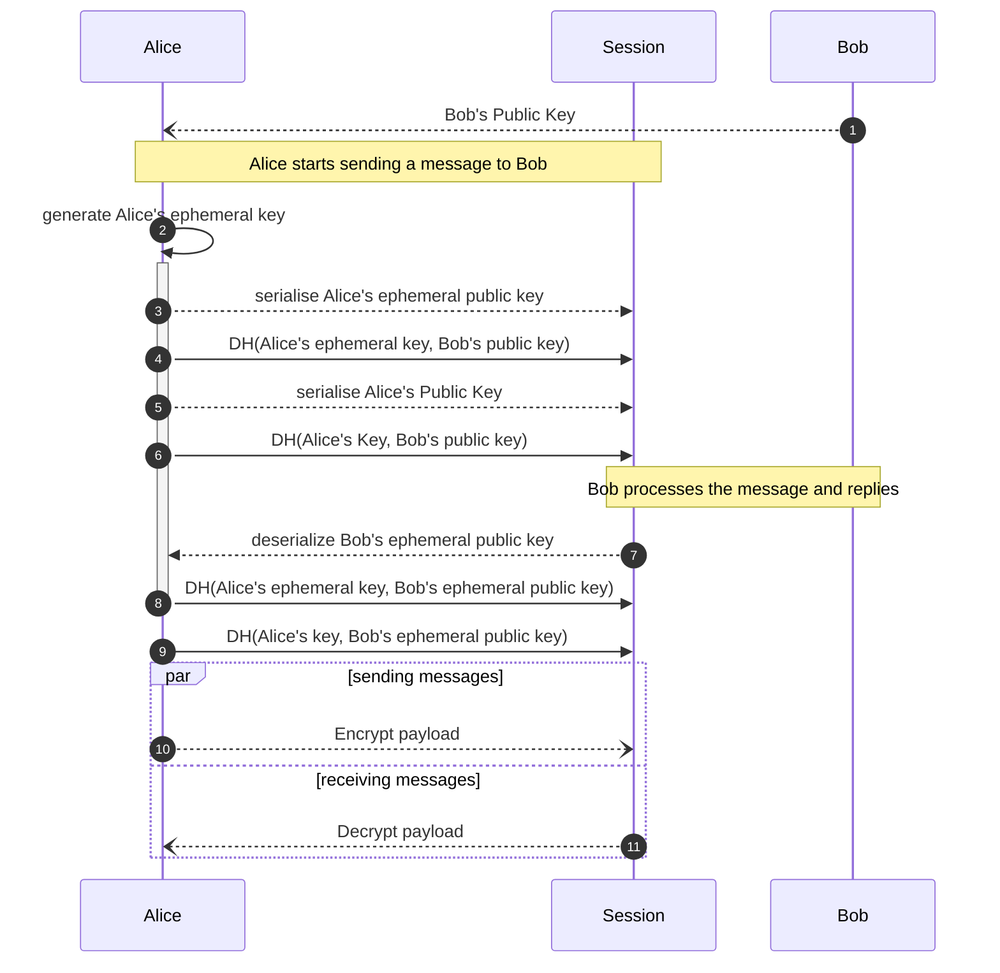
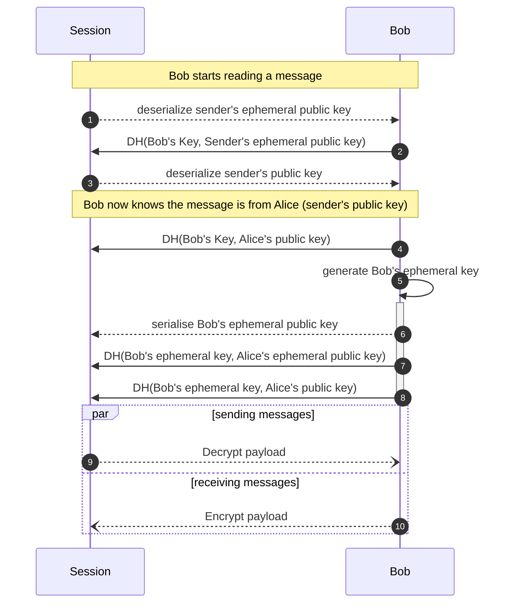

# Noise

The [Noise Protocol] is a framework that we use for our cryptographic
protocols. It defines how to establish encrypted sessions between
senders and recipients.

> Noise protocols support mutual and optional authentication, identity hiding,
> forward secrecy, zero round-trip encryption, and other advanced features.

* _mutual authentication_: it means all the participants are proving to
  their identity to each others;
* _identity hiding_: means that no outside observer can find out the
  identity of the participants;
* _forward secrecy_: it means that even if the long term keys of the participants
  are compromised the session keys are protected as well as protecting the past
  keys if the recent keys are compromised. In other words: we are protecting
  the past communications.
* _zero round-trip encryption_: it is possible to send encrypted application
  data to a recipient without prior exchanged messages.

How the encrypted sessions are established is called Handshake Patterns. These
are the first sequence of messages the participants are to exchanged in order
to establish the encrypted session.

We are leveraging different of these handshake pattens in our protocols. These
patterns are described below.

## Pattern: `X`

* ✅ Mutual authentication
* ✅ Zero round trip encryption
* ✅ Identity hiding
* ❌ Forward secrecy

This pattern allows for 0 round trip encryption. Yet it allows to authenticate
both the sender to the receiver (the sender's public key is transmitted in the
message -- encrypted). Only the recipient can retrieve the identity of the sender.

This type of message is used by **ASMTP** to encrypt the messages users will
send to each other. The `Public Key` used here are the `Shared Key` in Alice's
and Bob's respective passports.

### encrypting the message

1. Alice needs to know Bob's public key in advance;
2. Alice generates an ephemeral key. Its lifetime is limited to the configuration of the session and needs the key will need to be securely destroyed once no longer needed;
3. Alice sets the ephemeral public key in the session. It is serialized in the message payload and is used to update the encryption state of the session;
4. Alice sets the result of the key exchange (Diffie-Hellman: _DH_) between the ephemeral private key and Bob's public key. Alice can now destroy the ephemeral secret key.
5. Alice sets her public key in the session. It is serialized in the mesasge payload and is used to update the encryption state of the session;
6. Alice sets the result of the key exchange (Diffie-Hellman: _DH_) between her private key and Bob's public key.
7. Alice sets the payload to encrypt.

### decrypting the message

1. Bob deserializes the ephemeral public key from the payload;
2. Bob sets the result of the key exchange (_DH_) between his private key and the deserialized ephemeral public key;
3. Bob deserializes the sender's public key.
4. Bob sets the result of the key exchange (_DH_) between his private key and the deserialized sender's public key;
5. Bob decrypts the payload

More info on [`Noise's explorer`](https://noiseexplorer.com/patterns/X/)

## Pattern: `Npsk0`

* ✅ Mutual authentication: thanks to the psk
* ✅ Zero round trip encryption: we only care about the recipient reading the message
* ✅ Identity hiding: it is not possible to know who are the participants of this exchange
* ❌ Forward secrecy: if the `psk` or the recipient keys are compromised the message is compromised

This pattern is used to encrypt the shared secret key in the passport's blocks.
Using this pattern allows us to have a fairly small encrypted data
in the passport that requires only the extra ephemeral public key
to be stored along with the encrypted data.

### encrypting the message

1. Alice needs to know Bob's public key in advance;
2. Alice sets a pre-shared secret, usually it can be a password for example. Bob will need to be aware of that secret too in order to decrypt the message;
3. Alice generates an ephemeral key. Its lifetime is limited to the configuration of the session and needs the key will need to be securely destroyed once no longer needed;
4. Alice sets the ephemeral public key in the session. It is serialized in the message payload and is used to update the encryption state of the session;
5. Alice sets the result of the key exchange (Diffie-Hellman: _DH_) between the ephemeral private key and Bob's public key. Alice can now destroy the ephemeral secret key.
6. Alice sets the payload to encrypt.

### decrypting the message

1. Bob sets the pre-shared secret, it needs to be the same as the one Alice used;
2. Bob deserializes the ephemeral public key from the payload;
3. Bob sets the result of the key exchange (_DH_) between his private key and the deserialized ephemeral public key;
4. Bob decrypts the payload

More info on [`Noise's explorer`](https://noiseexplorer.com/patterns/Npsk0/)

## Pattern: `IK`

* ✅ Mutual authentication
* ❌ Zero round trip encryption
* ✅ Identity hiding
* ✅ Forward secrecy

In only one round trip we can establish the most secure form of encrypted
session available to us. The only prerequisite to establish this kind of
session is to know in advance the public key of the remote peer.

It starts exactly like the `X` pattern described previously. However we are
assuming the session to be finally started after another message is received
from the recipient.

This pattern is used to establish secure and long connections between nodes
on the network. The public keys used here are the same one serialised in the
[poldercast's gossips]. This guarantees we are talking to the appropriate
nodes for the right reasons (see [poldercast] for more details).

### encrypting the message

1. Alice needs to know Bob's public key in advance;
2. Alice generates an ephemeral key. Its lifetime is limited to the configuration of the session and needs the key will need to be securely destroyed once no longer needed;
3. Alice sets Alice's ephemeral public key in the session. It is serialized in the message payload and is used to update the encryption state of the session;
4. Alice sets the result of the key exchange (Diffie-Hellman: _DH_) between Alice's ephemeral private key and Bob's public key.
5. Alice sets her public key in the session. It is serialized in the message payload and is used to update the encryption state of the session;
6. Alice sets the result of the key exchange (Diffie-Hellman: _DH_) between her private key and Bob's public key.
7. Alice deserializes Bob's ephemeral public key;
8. Alice sets the result of the key exchange (Diffie-Hellman: _DH_) between Alice's ephemeral private key and Bob's ephemeral public key. Alice's ephemeral key can now be securely destroyed.
9. Alice sets the result of the key exchange (Diffie-Hellman: _DH_) between Alice's private key and Bob's ephemeral public key.
10. Alice can use the session to send messages to Bob
11. Alice can use the session to receive messages from Bob

### decrypting the message

1. Bob deserializes the sender's ephemeral public key from the payload;
2. Bob sets the result of the key exchange (_DH_) between his private key and the sender's ephemeral public key;
3. Bob deserializes the sender's public key, we now know it is Alice.
4. Bob sets the result of the key exchange (_DH_) between his private key and Alice's public key;
5. Bob generates an ephemeral key. Its lifetime is limited to the configuration of the session and needs the key will need to be securely destroyed once no longer needed;
6. Bob sets Bob's ephemeral public key in the session. It is serialized in the message payload and is used to update the encryption state of the session;
7. Bob sets the result of the key exchange (Diffie-Hellman: _DH_) between Bob's ephemeral private key and Alice's ephemeral public key.
8. Bob sets the result of the key exchange (Diffie-Hellman: _DH_) between Bob's ephemeral private key and Alice's public key.
9. Bob can use the session to receive messages from Alice
10. Bob can use the session to send messages to Alice

More info on [`Noise's explorer`](https://noiseexplorer.com/patterns/IK/)

[Noise Protocol]: https://noiseprotocol.org
[poldercast]: ./poldercast.md
[poldercast's gossips]: ./poldercast.md#gossips